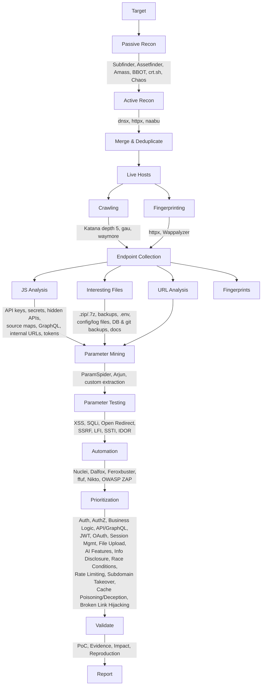

# Automated Bug Bounty Recon Pipeline

A modular, end-to-end reconnaissance and vulnerability-testing pipeline for authorized bug bounty and security research engagements — from passive subdomain discovery through manual exploitation and reporting.

> ⚠️ **Authorized use only.** This tool is intended strictly for targets you are explicitly authorized to test (in-scope bug bounty programs, your own infrastructure, or environments with written permission). Running this against out-of-scope or unauthorized targets may be illegal. You are responsible for confirming scope before running any module.

---

## Pipeline Overview




<details>
<summary>Text version</summary>

```
Target
  │
  ├─ Passive Recon      → Subfinder, Assetfinder, Amass, BBOT, crt.sh, Chaos
  ├─ Active Recon        → dnsx, httpx, naabu
  ├─ Merge & Deduplicate
  ├─ Live Hosts
  │     ├─ Crawling       → Katana, gau, waymore
  │     └─ Fingerprinting → httpx, Wappalyzer
  ├─ Endpoint Collection
  │     ├─ URL Analysis
  │     ├─ JS Analysis    → API keys, secrets, hidden APIs, source maps, GraphQL, internal URLs, tokens
  │     ├─ Interesting Files → .zip/.7z, backups, .env, config/log files, DB & git backups, docs
  │     └─ Fingerprints
  ├─ Parameter Mining     → ParamSpider, Arjun, custom extraction
  ├─ Parameter Testing    → XSS, SQLi, Open Redirect, SSRF, LFI, SSTI, IDOR
  ├─ Automation            → Nuclei, Dalfox, Feroxbuster, ffuf, Nikto, OWASP ZAP
  ├─ Prioritization        → Auth, AuthZ, Business Logic, API/GraphQL, JWT, OAuth,
  │                          Session Mgmt, File Upload, AI Features, Info Disclosure,
  │                          Race Conditions, Rate Limiting, Subdomain Takeover,
  │                          Cache Poisoning/Deception, Broken Link Hijacking
  ├─ Validate              → PoC, evidence, impact, reproduction steps
  └─ Report
```

</details>

## Why this exists

Most public recon tutorials cover one stage in isolation. This project chains the stages together so recon output from one tool automatically feeds the next — reducing the manual copy-pasting between tools and standardizing the same methodology across every target.

## Modules

| Stage | Script | Tools Used |
|---|---|---|
| Passive Recon | `modules/01_passive_recon.sh` | subfinder, assetfinder, amass, bbot, crt.sh, chaos |
| Active Recon | `modules/02_active_recon.sh` | dnsx, httpx, naabu |
| Crawling & Fingerprinting | `modules/03_crawl_and_fingerprint.sh` | katana, gau, waymore, httpx, wappalyzer |
| JS Analysis | `modules/04_js_analysis.sh` | custom grep/regex one-liners |
| Interesting Files | `modules/05_interesting_files.sh` | custom extension matching |
| Parameter Mining | `modules/06_param_mining.sh` | paramspider, arjun |
| Automated Scanning | `modules/07_automated_scan.sh` | nuclei, dalfox, feroxbuster, ffuf, nikto |
| Report Scaffold | `modules/08_report_scaffold.sh` | generates a PoC/evidence/impact template |

## Requirements

Install the underlying tools first (most are Go-based):

```bash
# Go-based tools
go install -v github.com/projectdiscovery/subfinder/v2/cmd/subfinder@latest
go install -v github.com/projectdiscovery/dnsx/cmd/dnsx@latest
go install -v github.com/projectdiscovery/httpx/cmd/httpx@latest
go install -v github.com/projectdiscovery/naabu/v2/cmd/naabu@latest
go install -v github.com/projectdiscovery/katana/cmd/katana@latest
go install -v github.com/projectdiscovery/nuclei/v3/cmd/nuclei@latest
go install -v github.com/tomnomnom/assetfinder@latest
go install -v github.com/lc/gau/v2/cmd/gau@latest
go install -v github.com/ffuf/ffuf/v2@latest

# Python-based tools
pip install arjun --break-system-packages
pip install uro --break-system-packages

# Others: amass, bbot, waymore, paramspider, feroxbuster, nikto, dalfox
# See docs/INSTALL.md for full setup instructions per OS.
```

## Usage

```bash
git clone https://github.com/<your-username>/bug-bounty-recon-pipeline.git
cd bug-bounty-recon-pipeline
chmod +x recon.sh modules/*.sh

# Run the full pipeline against an in-scope target
./recon.sh -d example.com -o output/example.com

# Run a single stage
./modules/01_passive_recon.sh example.com output/example.com
```

## Output Structure

```
output/<target>/
├── subdomains/
│   ├── all.txt
│   └── live.txt
├── ports/
├── endpoints/
│   ├── urls.txt
│   ├── js_files.txt
│   └── interesting_files.txt
├── js_analysis/
│   ├── secrets.txt
│   ├── endpoints.txt
│   └── source_maps.txt
├── params/
├── scans/
│   ├── nuclei_results.txt
│   └── ffuf_results.txt
└── report/
    └── findings_template.md
```

## Roadmap

- [ ] Subdomain takeover detection (dnsx + nuclei takeover templates)
- [ ] Cache poisoning / cache deception checks
- [ ] Broken link hijacking detection
- [ ] Dependency confusion checks against npm/PyPI for names found in JS/configs
- [ ] Slack/Discord webhook notifications for new findings

## Disclaimer

This project is for educational and authorized security testing purposes only. The author is not responsible for misuse. Always follow the target program's rules of engagement and stay within scope.

## License

MIT License — see [LICENSE](LICENSE).
